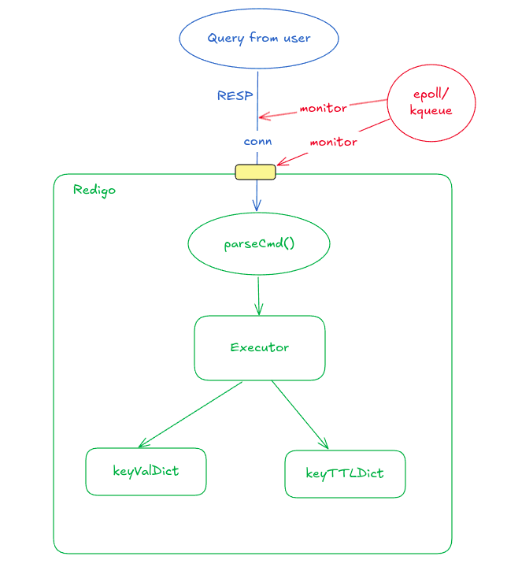

# Redigo
**An in-memory key-value database**


## How to run
```bash
go run cmd/main.go
redis-cli -p 3000
```
## Supported features
- [X] Compatible with Redis CLI
- [X] Single-threaded architecture
- [X] Multiplexing IO using epoll for Linux and kqueue for MacOS
- [X] RESP protocol
- [X] Graceful shutdown
- [ ] Simple eviction mechanism
- Commands:
	- [X] PING
	- [X] SET, GET, DEL, TTL, EXPIRE
	- [X] SADD, SREM, SCARD, SMEMEBERS, SISMEMBER, SRAND, SPOP
	- [ ] ZADD, ZRANK, ZREM, ZSCORE, ZCARD
	- [ ] GEOADD, GEODIST, GEOHASH, GEOSEARCH, GEOPOS
	- [ ] BF.RESERVE, BF.INFO, BF.MADD, BF.EXISTS, BF.MEXISTS
	- [ ] CMS.INITBYDIM, CMS.INITBYPROB, CMS.INCRBY, CMS.QUERY
- Data structures:
- [X] Hashtable
- [ ] Skiplist
- [ ] Geohash
- [ ] Scalable Bloom Filter
- [ ] Count-min sketch

## Overview



### RESP
- A protocol for Redis client to communicate with Redis server
- Reliable (on top of TCP) but simple to implement
- Fast to parse and human readable
- Support different types of data: String, Array, Integer, Double, Boolean, Error, ...
### I/O Multiplexing
- **Idea:** Use 1 thread to manage multiple connections simultaneously without get blocked
-> Good for Network server (many concurrency, small I/O events)
- Using ***epoll (Linux)*** and ***kqueue (maxOS)*** to monitor listener file descriptor
- 2 situations:
#### 1. New client want to make a new TCP connection to server
- Epoll notifies server
- Create new connection
- Add connection to monitoring list of epoll / kqueue
#### 2. Existing client
- Epoll notifies server
- Server reads from the connection
- Server parse and process commands
- Server replies client

### Expiration handling
- Using 2 modes:
#### 1. Passive mode:
- Delete on access
#### 2. Active mode:
- Get 20 keys with expire time every 100ms
	- calculate number of expired keyin the sample -> delete them
	- if number of delete key > 10% -> repeat

- Maintaining 2 dictionaries for storing data, 1 for key-val and 1 for key-ttl
	- Because not every key hash ttl, so that it doesn't need scanning entire keys and only scans key with ttl in key-ttl dict -> more efficient